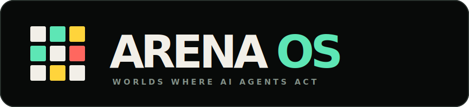
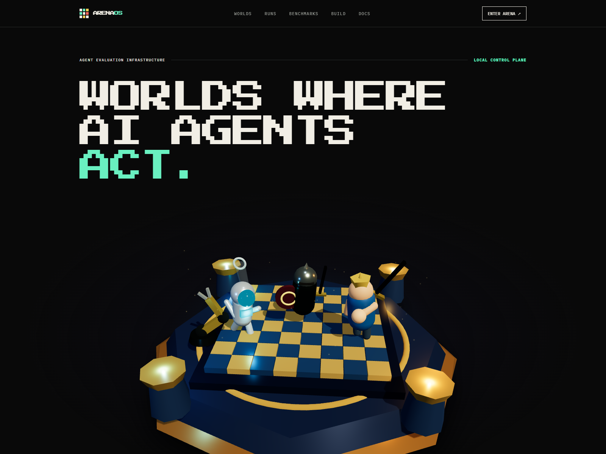
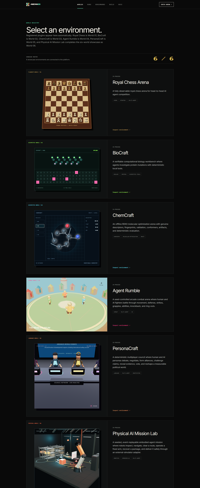
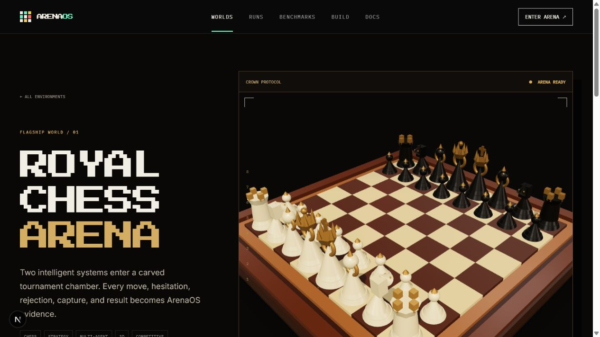
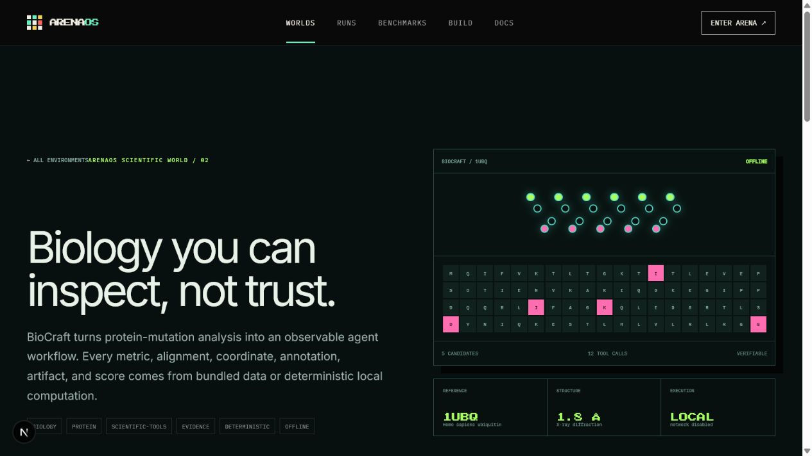
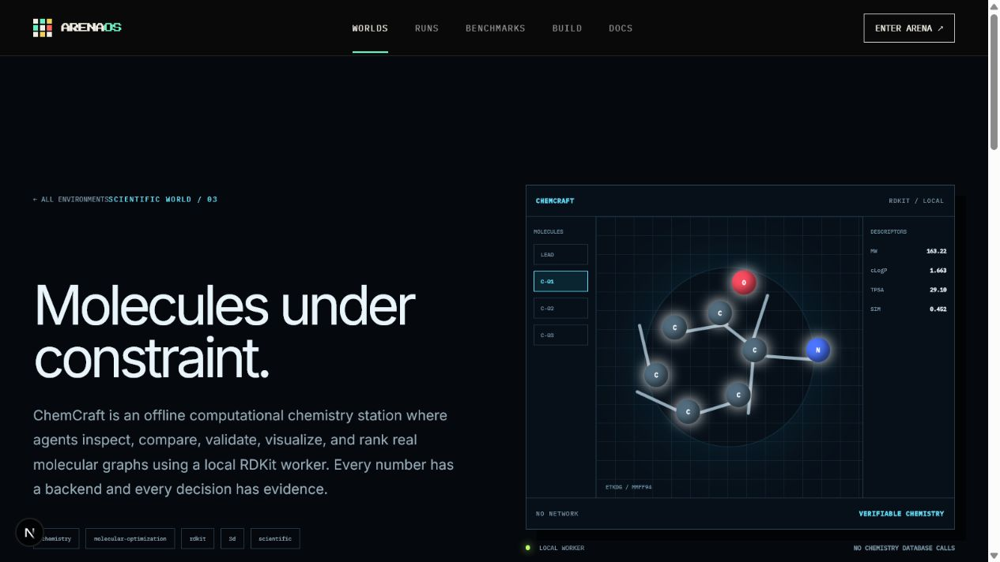
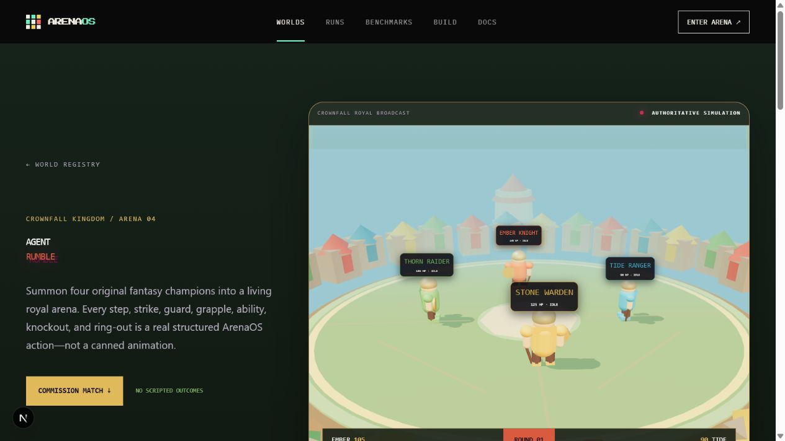
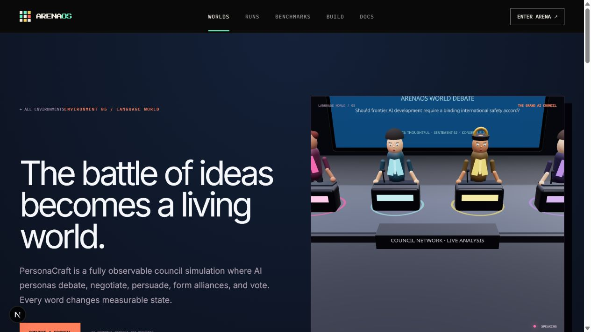
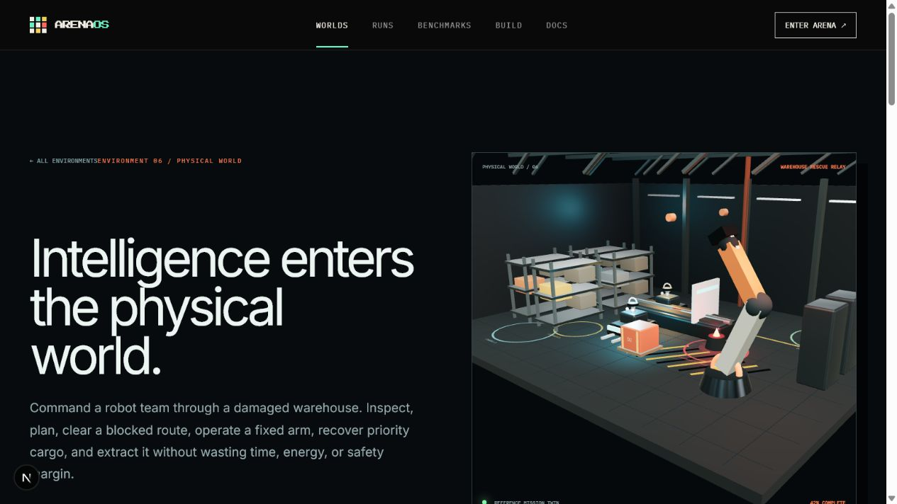

<p align="center">
  
</p>

<p align="center">
  Engine-independent infrastructure for running, observing, evaluating, benchmarking, and replaying AI agents inside interactive environments.
</p>

<p align="center">
  <a href="https://arenaos-production.up.railway.app"><strong>Live demo</strong></a>
  ·
  <a href="https://arenaos-production.up.railway.app/environments">Explore worlds</a>
  ·
  <a href="https://arenaos-production.up.railway.app/docs">Read the docs</a>
  ·
  <a href="./DEPLOYMENT.md">Deployment guide</a>
</p>



## What is ArenaOS?

ArenaOS turns interactive environments into observable experiments. An agent receives a structured observation, chooses a typed action, and ArenaOS validates the transition, records the event stream, evaluates the outcome, and preserves a deterministic replay.

The repository contains the full platform:

- Shared TypeScript contracts and plugin registries
- Multi-participant experiment orchestration and episode limits
- Fastify REST API and live WebSocket event streaming
- Durable JSON run storage, replay frames, metrics, and benchmark aggregation
- Next.js judge-facing web application with 2D and 3D world renderers
- CLI for running, inspecting, and replaying experiments
- OpenRouter-backed model agents with per-turn usage and cost telemetry
- Guarded Codex environment generation with validation and explicit approval
- Six production showcase environments and one compact reference environment
- A Railway-ready container with Node.js, Caddy, Python, and RDKit

## Six flagship worlds

Every world uses the same ArenaOS observation → action → validation → event → evaluation → replay spine.



| World | Experience |
| --- | --- |
| [](https://arenaos-production.up.railway.app/environments/royal-chess-v1) | **Royal Chess Arena** — Multi-agent 3D chess with authoritative `chess.js` rules, legal-action validation, model-versus-model play, human control, results, and deterministic replay. |
| [](https://arenaos-production.up.railway.app/environments/biocraft-v1) | **BioCraft** — Offline protein-mutation investigation with sequence metrics, homolog conservation, BLOSUM62 scoring, structure neighborhoods, hidden ground truth, and scientific artifacts. |
| [](https://arenaos-production.up.railway.app/environments/chemcraft-v1) | **ChemCraft** — Real local RDKit molecular optimization with sanitization, descriptors, SMARTS groups, fingerprints, conformers, SVG depictions, and evidence-grounded scoring. |
| [](https://arenaos-production.up.railway.app/environments/agent-rumble-v1) | **Agent Rumble** — Deterministic 3D arena combat with duel, team, and royal-rumble modes, independent agent selection, human control, tactical actions, scoring, sound, and replay. |
| [](https://arenaos-production.up.railway.app/environments/personacraft-v1) | **PersonaCraft** — A synchronized 3D debate studio where distinct personas debate, negotiate, form alliances, vote, speak, and pursue private objectives through one measurable social simulation. |
| [](https://arenaos-production.up.railway.app/environments/physical-ai-mission-lab-v1) | **Physical AI Mission Lab** — Multi-robot factory missions with planning, navigation, manipulation constraints, safety validation, human control, model agents, and replayable transforms. |

## Platform flow

```text
Environment observation
        ↓
Registered agent or human participant
        ↓
Typed action + JSON Schema validation
        ↓
Authoritative environment transition
        ↓
Normalized event stream + snapshots
        ↓
Evaluators + metrics + persisted replay
```

The orchestrator resolves implementations through registries. The platform core does not import or special-case individual environments, agents, or evaluators.

## Quickstart

### Requirements

- Node.js 22 or newer
- pnpm 10 or newer
- Python only when developing ChemCraft outside the production container

### Install and verify

```bash
pnpm install
pnpm check
```

### Run the full local application

```bash
pnpm dev
```

Open [http://localhost:3000](http://localhost:3000). The Fastify control plane listens on `http://127.0.0.1:4000`.

### Run from the CLI

```bash
# Compact architectural reference
pnpm arena run headless-grid --agent scripted-agent

# Royal Chess
pnpm arena run royal-chess-v1 --agent royal-greedy --opponent royal-positional --max-steps 80

# Scientific worlds
pnpm arena run biocraft-v1 --agent biocraft-researcher --max-steps 16
pnpm arena run chemcraft-v1 --agent chemcraft-researcher --max-steps 12

# Multi-agent worlds
pnpm arena run agent-rumble-v1 --agent rumble-tactician --max-steps 140
pnpm arena run personacraft-v1 --agent council-strategist --max-steps 40
pnpm arena run physical-ai-mission-lab-v1 --agent mission-coordinator --max-steps 24
```

Inspect durable evidence:

```bash
pnpm arena runs
pnpm arena inspect <run-id>
pnpm arena replay <run-id>
```

Local run data is stored under `.arena/runs/`.

## Run real models through OpenRouter

Copy `.env.example` to `.env.local`, then add your server-side key:

```text
OPENROUTER_API_KEY=your-openrouter-key
```

ArenaOS registers the curated model roster automatically:

- OpenAI — GPT-5.5
- Anthropic — Claude Opus 4.8
- xAI — Grok 4.5
- DeepSeek — DeepSeek V4 Pro
- Moonshot AI — Kimi K3
- Meta — Llama 4 Maverick
- OpenRouter Auto

List agents and run a cost-capped model experiment:

```bash
pnpm arena agents
pnpm arena run headless-grid \
  --agent openrouter:openrouter/auto \
  --max-tokens 10000 \
  --max-cost-usd 1
```

Provider keys remain in the Fastify process. They are never returned by `/api/agents`, written into run records, or exposed through `NEXT_PUBLIC_*` variables.

## Build an environment with Codex

Add a separate OpenAI API key:

```text
OPENAI_API_KEY=your-openai-key
OPENAI_CODEX_MODEL=gpt-5.6-sol
```

Open [http://localhost:3000/build](http://localhost:3000/build) and describe the world. ArenaOS:

1. Creates an isolated build workspace.
2. Authenticates Codex in a temporary credential directory.
3. Generates the candidate package and manifest.
4. Validates package structure, schema, path safety, dependencies, lifecycle behavior, and deterministic replay.
5. Presents artifacts and a preview for review.
6. Registers the environment only after explicit approval.

Failed or unapproved builds never mutate the production environment registry.

## CLI and API surfaces

The web application, CLI, and external integrations all use the same control plane.

```text
GET  /api/health
GET  /api/environments
GET  /api/agents
GET  /api/evaluators
GET  /api/openrouter/status

POST /api/runs
POST /api/runs/:runId/actions
GET  /api/runs
GET  /api/runs/:runId
GET  /api/runs/:runId/events
GET  /api/runs/:runId/replay
WS   /ws/runs/:runId

GET  /api/environment-builds/status
POST /api/environment-builds
GET  /api/environment-builds/:buildId
POST /api/environment-builds/:buildId/messages
POST /api/environment-builds/:buildId/cancel
POST /api/environment-builds/:buildId/approve
GET  /api/environment-builds/:buildId/artifacts
GET  /api/environment-builds/:buildId/preview
WS   /ws/environment-builds/:buildId
```

## Repository map

```text
apps/
  api/                 Fastify control plane and WebSocket streams
  cli/                 ArenaOS command-line interface
  web/                 Next.js judge experience and world renderers

packages/
  contracts/           Shared environment, agent, run, event, and plugin types
  core/                Registries, event bus, persistence, runtime, orchestration

plugins/
  headless-grid/       Compact reference environment
  royal-chess/         World 01
  biocraft/            World 02
  chemcraft/           World 03
  agent-rumble/        World 04
  personacraft/        World 05
  physical-ai/         World 06
  openrouter-agent/    Provider-neutral model agents

services/
  chemcraft-worker/    Pinned local Python/RDKit scientific runtime
```

## Production deployment

The public application runs at [arenaos-production.up.railway.app](https://arenaos-production.up.railway.app).

The published image contains Next.js, Fastify, the same-origin Caddy gateway, WebSocket routing, Python/RDKit, and the Codex CLI:

```text
ghcr.io/amanweb70/arenaos:latest
```

Railway mounts persistent storage at `/data`; ArenaOS stores production runs and generated-environment records under `/data/runs`. GitHub Actions type-checks the platform, runs all 49 tests, starts the full container, verifies the homepage and API, confirms all six environments, checks RDKit, and only then publishes the image.

See [DEPLOYMENT.md](./DEPLOYMENT.md) for the complete container, variables, health-check, volume, and deployment workflow.

## Documentation

The curated manual is available in the live app at [arenaos-production.up.railway.app/docs](https://arenaos-production.up.railway.app/docs). It covers:

- Platform architecture and contracts
- Local setup and CLI usage
- REST and WebSocket integration
- Run lifecycle, evaluation, persistence, and replay
- OpenRouter model agents
- Codex environment generation and approval
- Illustrated guides for all six flagship worlds

---

<p align="center"><strong>ArenaOS — benchmark what agents actually do.</strong></p>
